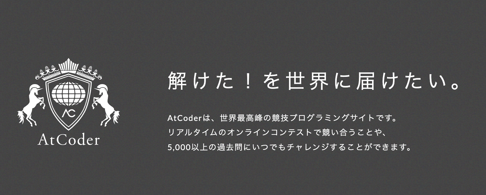
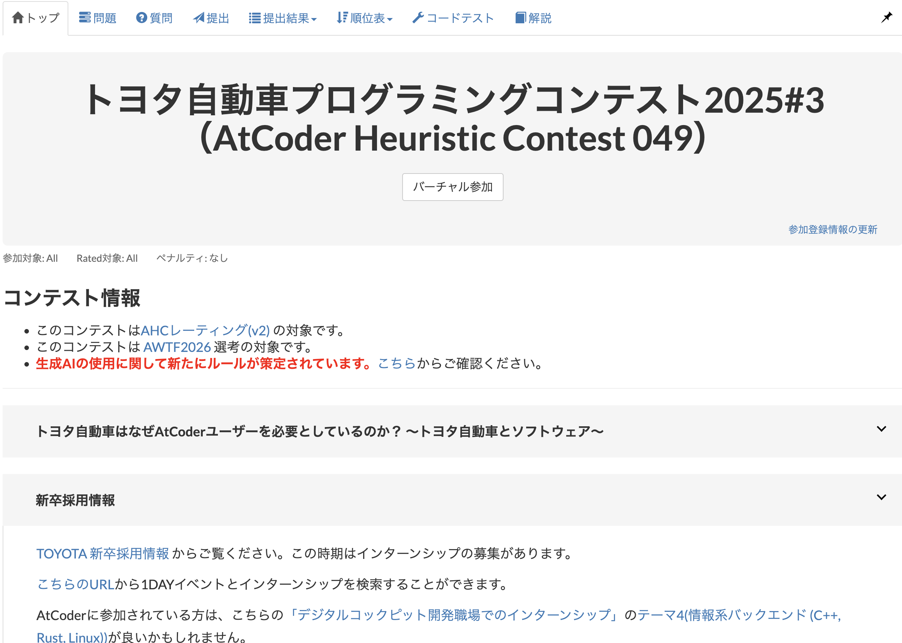
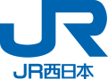
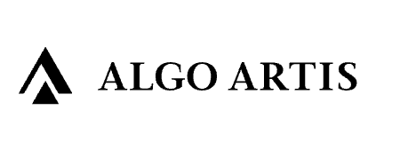

<!-- _class: title -->
<!-- paginate: false -->

# AHCコンテスト共催について
2026-01-26

---

<!-- paginate: true -->
<!-- _class: divider -->

# 1

## AtCoderとは

---

# AtCoderとは

## 国内最大の競技プログラミングサイト

### 企業ステータス

- 2012年設立、日本発の競技プログラミングプラットフォーム
- 登録者数：**80万人以上**（世界でも有数の規模）
- 毎週末にコンテストを開催、数千人が参加
- トヨタ、パナソニック、NTT、リクルート等の大手企業が協賛

### レーティングシステム

- 能力を数値と色（8段階）で可視化
- 過去の全成績からアルゴリズムで算出
- 赤(上位0.03%)～橙～黄～青～水色(上位10%)～緑～茶(上位50%)～灰

<table class="img-table">
<tr><td style="text-align:center;"></td></tr>
<tr><td style="text-align:center;">AtCoderトップページ</td></tr>
<tr><td style="text-align:center;"></td></tr>
<tr><td style="text-align:center;">レーティング分布</td></tr>
</table>

---

<!-- _class: divider -->

# 2

## AHCとは

---

# AHC（AtCoder Heuristic Contest）

## AtCoderが開催する最適化コンテスト

### コンテスト形式

| 形式 | 内容 |
|------|------|
| ABC等 | 正解を出す問題 |
| **AHC** | より良い解を探す問題 |

- 厳密な正解が存在しない問題に挑戦
- 制限時間内でどこまで改善できるかを競う
- 効率性・コスト削減度でスコア化
- 実務の最適化課題に近い形式

- 例：トヨタ自動車プログラミングコンテスト
- 最適化人材へのリーチと自社技術のアピールを実施
- コンテストページで企業の取り組みを紹介

---

# 鉄道業界×数理最適化

## 弊社が抱える最適化課題

| 領域 | 課題例 | 期待効果 |
|------|--------|----------|
| **ダイヤ編成** | 遅延時の運転整理、運用最適化 | 定時性向上 |
| **乗務員計画** | 乗務員シフト・行路作成 | 人件費削減 |
| **車両運用** | 検査周期を考慮した車両配置 | 稼働率向上 |
| **保線計画** | 線路保守作業のスケジューリング | 工事費削減 |
| **駅業務** | 駅設備設置順序、改札配置 | 安全性・効率性 |

- 鉄道業界は制約条件が多く、最適化の余地が大きい
- 1%の改善でも大きなコスト削減につながる
- AHCで培われるスキルと鉄道課題の相性が良い

---

# 開催概要

## JR西日本 × ALGO ARTIS 共催

| 項目 | 内容 |
|------|------|
| **開催日** | 2026年4月26日（日） |
| **時間** | 4時間（15:00-19:00 or 19:00-23:00） |
| **形式** | AtCoder Heuristic Contest（オンライン） |
| **共催** | JR西日本 × ALGO ARTIS |

### 共催の意義

- **AtCoderのコンテストで企業共催は初の試み**
- ALGO ARTISは最適化分野のトップランナー企業
- 両社の知見を活かした問題設計が可能
- 最適化コミュニティへの強いアピールになる

<table class="logo-table">
<tr><td style="text-align:center;">×</td></tr>
<tr><td style="text-align:center;">共催</td></tr>
<tr><td style="text-align:center; font-size:40px;">▼</td></tr>
<tr><td style="text-align:center;"></td></tr>
<tr><td style="text-align:center;">コンテストプラットフォーム</td></tr>
</table>

---

# 開催メリット

## JR西日本が得られる成果

### 採用・ブランディング

- **数理最適化エンジニアの採用強化**
  鉄道×最適化に興味を持つ層へ直接リーチ
- **参加者情報の取得**
  約1,000名の登録情報を獲得可能
- **技術ブランドの確立**
  最適化に取り組む先進的企業としての認知向上
- **社内エンジニアの育成機会**
  社員参加による技術力向上

### コンテスト内での露出

- コンテストページに社内の取り組み紹介を掲載可能
- 参加者全員が目にする高い露出効果
- 鉄道業界の最適化課題を問題として出題可能
- 問題を通じてJR西日本の技術課題を発信

