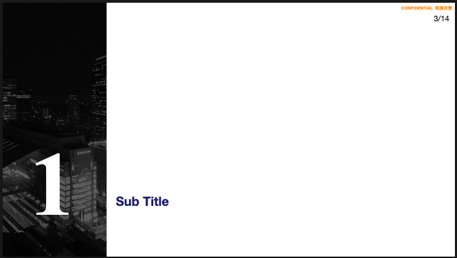

# Marp によるスライドの作成

Marp を使ってスライドを作成するためのテンプレートです。

`jrw_theme.css`で以下のようなスライドのデザインを作成しています。

メインの表紙のスライド


セクション区切りのスライド


## 想定

- VScode + Marp でスライドを作成することを想定
- `template_project/template_event/template.md`をコピペして使うことを想定
- プロジェクト毎に管理することを想定
  - 各報告会毎に管理することを想定

## プロジェクト毎のフォルダ管理について

テンプレートに使う画像は相対パスでしか指定できないので以下のフォルダ構成を想定しています。

```text
project_name/
├── yyyyMMdd_eventA/
│   ├── images/
│   └── yyyyMMdd_報告資料.md
└── yyyyMMdd_eventB/
    ├── images/
    └── yyyyMMdd_報告資料.md
```

このように各プロジェクトディレクトリの中に報告会などのイベントのディレクトリがある構造を想定しています。

各イベントのディレクトリの中にスライド(.md ファイル)とスライドに貼るための画像をまとめるディレクトリがあるように作成しています。

### 例

```text
├── A社
│   └── yyyyMMdd_中間報告会
        ├── images
        └── 報告資料.md
```

## 設定

細かい設定は `jrw_theme.css` で変更可能です。  
`jrw_theme.css`には以下が定義されています

- タイトルスライド
- 目次スライド
- 章区切りスライド
