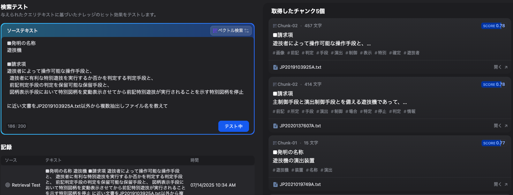

<!-- tailwind cssを使う -->
<!-- 
 -->

<!-- _class: title -->
<!-- paginate: false -->

# NEDO現状

## 2025-07-15 ｜ 現状

---

<!-- _class: agenda -->

# Table of Contents

1. 概要
2. Difyの実験の現状
3. 今後

---

<!-- paginate: true -->
<!-- _class: divider -->

# 1

## 概要

---

# 解くべき課題

## 以下の機能を有したプロトタイプの作成する
 

### 情報探索
  * 審査員がテストケースαを読み込ませる
  * 請求項1に関連する文献A(x)を1個提示する
  * 請求項2以降に関連する文献A(y)を2-4個提示する

### 提示する文献について
  * 一致箇所をハイライトする
  * 流暢さ･論理性･情報の過不足を考慮して提示する

### ユーザビリティ
  * 必須4機能（読込、探索、表示、根拠出力）を満たす
  * さらに直感的に使いやすいこと

---

# データ

##  国内特許文献データ
  * `result_1.tar.gz` ~ `result_18.tar.gz`
  * 合計435万件で展開時561GB
  * `.txt`形式だが中身はXML
 
## 出願とその紐付き文献の関係を示すCSVデータ
  * `syutugan`, `himotuki`, `category`, `kousinbi` の4つのカラム
  * `syutugan`は出願番号、`himotuki`は紐付き文献番号、`category`は文献の種類、`kousinbi`は更新日
    * category: A(x), A(y)
  * これが答えになる
    * syutuganがα, himotukiが表示すべきA(x), A(y)の文献番号
  * 実際のテストケースも含まれている

---
<!-- paginate: true -->
<!-- _class: divider -->

# 2

## Difyによる実験

---
# 準備

##  ナレッジ登録
  * 一部データを抽出してナレッジ登録
  * `result_X.tar.gz`からsyutuganとhimotukiのペアを含むデータを数百~数千件抽出
  * xmlを`.txt`か`.csv`に変換して登録

 

## 検索テスト
  * `syutugan`にある文書を投げて`himotuki`を提示できるか
  * 一旦文書一致は無視し、該当の文書を提示できているかだけフォーカス

---
# txtデータにして実験

##  to txt
  * `<?xml version="1.0" encoding='utf-8'?>`みたいなXMLタグを含むデータをそのままナレッジ登録するとエラーになる
  * 適当にタグを削除してテキスト化した
    * 変換は✨️vibe coding✨️
  * 3000件程度のデータをナレッジ登録
    * これくらいがDifyに直接登録する限界

 

---
# txtデータにして実験

## 検索テスト
  * 同様に変換したtxtをテストに投げて近い文書が出るかテスト
  * 200字しか入力できないので請求項1を入力
  * 近い文書が出てきた
  * `JP2019103925A.txt以外から`というpromptは無視された

---
# csvデータにして実験

## データキュレーション
  * そもそも課題的に請求項1に対してA(x)と請求項2以降に対してA(y)の2つの文献を提示する必要がある
  * txtでは請求項1,2などの情報が管理しにくいので構造化された形式が良さそう
  * 変換は✨️vibe coding✨️

---
# ワークフローの作成

## ワークフロー
  * Difyのワークフローを作成
