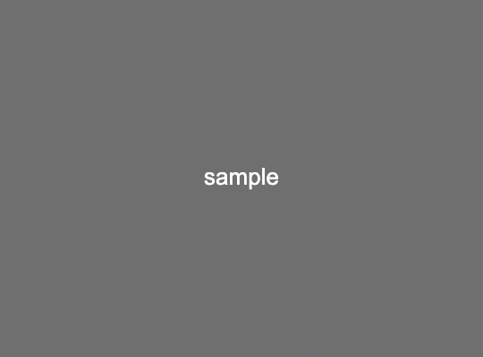

<!-- _class: title -->
<!-- paginate: false -->
# Main Title

## 202Y-mm-dd ｜ ご挨拶・ご紹介資料

---
<!-- _class: agenda -->

# Table of Contents

1. Agenda
2. Outline
3. Introduction
4. Overview

---
<!-- paginate: true -->
<!-- _class: divider -->
# 1

## Section title

---

# Images template format
<!-- center寄せで50%の大きさ -->



---

# Images template format
<!-- 右半分に30%の大きさ -->


---

# Images template format
<!-- 特に指定せずに二個画像を置くと左右に2枚並ぶ -->


---

# Images template format

<!-- verticalを指定することで縦に2枚並べられる -->


---
<!-- _class: divider -->
# 2

## Senction 2
---
# header 1

<!-- Pythonのコードもかける -->
## Python
```python
while True:
    if slide is None:
        break
```


---
